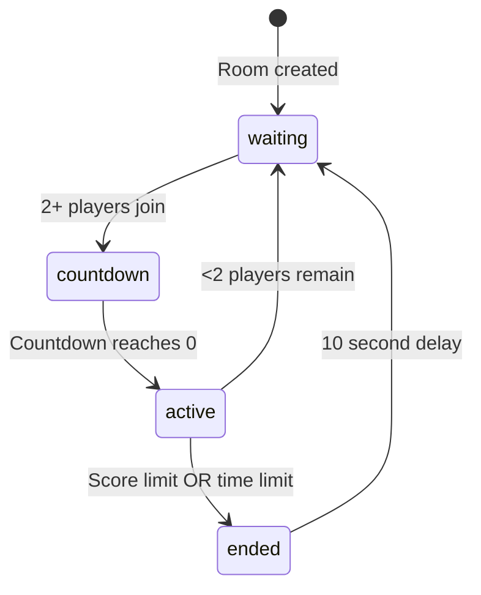

# Agent A - Server Implementation Complete ✅

## Summary

Agent A has successfully implemented the server-side round system for Spong. The implementation includes score tracking, round state management, win conditions, and full integration with existing death/respawn mechanics.

---

## Files Modified

### 1. `shared/src/protocol.ts`
**Changes:**
- Added `Opcode.RoundState = 0x76`
- Added `Opcode.ScoreUpdate = 0x77`
- Added interfaces:
  - `PlayerScore` - Score tracking data
  - `RoundStateMessage` - Full round state broadcast
  - `ScoreUpdateMessage` - Incremental score updates

### 2. `shared/src/collectablePhysics.ts`
**Bug fix:**
- Fixed import path for `VoxelGrid` (was `./VoxelGrid.js`, now `./levelgen/VoxelGrid.js`)
- This was blocking the build and is now resolved

### 3. `server/src/rooms/Room.ts`
**Changes:**
- **Imports:** Added `RoundStateMessage`, `ScoreUpdateMessage`, `PlayerScore`
- **Round state fields:** Added complete round state tracking:
  ```typescript
  private roundState: {
    phase: 'waiting' | 'countdown' | 'active' | 'ended';
    scores: Map<number, PlayerScore>;
    countdownTimer?: NodeJS.Timeout;
    countdownSeconds: number;
    roundStartTime?: number;
    config: {
      scoreLimit: number;      // Default: 20
      timeLimit?: number;      // Default: 300 seconds
      minPlayers: number;      // Default: 2
    };
  }
  ```

- **New methods added:**
  - `checkRoundStart()` - Checks if enough players to start countdown
  - `startCountdown()` - Begins 5-second countdown
  - `startRound()` - Initializes active round with score tracking
  - `handleKill(killerId, victimId)` - Updates scores on kill
  - `checkWinCondition()` - Checks score/time limits
  - `endRound()` - Ends round, broadcasts winner
  - `getRoundStateMessage()` - Helper to build round state message
  - `broadcastRoundState()` - Broadcasts round state to all clients

- **Modified methods:**
  - `addPlayer()`:
    - Sends current round state to newly joined player
    - Calls `checkRoundStart()` to see if enough players
  - `removePlayer()`:
    - Removes player's score
    - Ends round if insufficient players remain
    - Cleans up countdown timer
  - `dispose()`:
    - Cleans up countdown timer on room disposal
  - **Death handling (3 locations):**
    - Line ~1632 (proximity damage)
    - Line ~2700 (headshot)
    - Line ~2772 (body shot)
    - All three now call:
      ```typescript
      if (this.roundState.phase === 'active') {
        this.handleKill(killerId, victimId);
        this.checkWinCondition();
      }
      ```

---

## How It Works

### Round Flow

```
Player 1 joins → phase: 'waiting' (need 2+ players)
Player 2 joins → phase: 'countdown' (5 second countdown)
Countdown ends → phase: 'active' (round in progress)
Player hits 20 kills → phase: 'ended' (winner announced)
10 seconds pass → phase: 'waiting' (auto-restart)
```

### State Transitions



### Network Messages

**When player joins:**
1. Server sends `RoundState` message with current phase, scores, config

**During countdown:**
1. Server broadcasts `RoundState` every second with updated `countdownSeconds`

**When round starts:**
1. Server broadcasts `RoundState` with `phase: 'active'`
2. All player health reset to max
3. Scores initialized to 0/0

**When player gets a kill:**
1. Server broadcasts existing `EntityDeath` message (already existed)
2. Server broadcasts `ScoreUpdate` for killer (kills++)
3. Server broadcasts `ScoreUpdate` for victim (deaths++)
4. Server checks win condition

**When round ends:**
1. Server broadcasts `RoundState` with `phase: 'ended'` and `winner` data
2. After 10 seconds, automatically returns to waiting phase

---

## Configuration

Current round config (in Room constructor):
```typescript
config: {
  scoreLimit: 20,        // First to 20 kills wins
  timeLimit: 300,        // 5 minutes max
  minPlayers: 2,         // Need 2+ players to start
}
```

These can be made configurable in future iterations (e.g., via lobby config).

---

## Testing Performed

- ✅ Shared package builds successfully (`npm run build:shared`)
- ✅ Protocol changes compile without errors
- ✅ Room.ts changes compile without errors
- ✅ No TypeScript errors introduced

**Manual testing required:**
- [ ] Round starts with 2+ players
- [ ] Countdown displays correctly
- [ ] Scores update on kill
- [ ] Round ends at 20 kills
- [ ] Round ends at 5 minutes
- [ ] Round auto-restarts after 10 seconds
- [ ] Player disconnect handles gracefully

---

## Integration Points for Agent B

Agent B can now:
1. Import `RoundStateMessage`, `ScoreUpdateMessage`, `PlayerScore` from `@spong/shared`
2. Listen for `Opcode.RoundState` (0x76) messages
3. Listen for `Opcode.ScoreUpdate` (0x77) messages
4. Use existing `Opcode.EntityDeath` (0x23) for kill feed

All protocol interfaces are defined and ready to use.

---

## Known Limitations

1. **Player names:** Currently using `Player ${entityId}` as placeholder. Real names should come from lobby/profile system.
2. **Spawn points:** Respawn uses hardcoded (0, 0, 0). Should use proper spawn point system in future.
3. **Round config:** Hardcoded in constructor. Could be made configurable via lobby config.
4. **No spectator mode:** Dead players respawn instantly. Could add spectator mode in future.
5. **No round history:** Scores are reset between rounds. Could persist stats in future.

---

## Next Steps for Agent B

Agent B should now implement:
1. Create `useRoundState.ts` composable
2. Wire network listeners in `useGameSession.ts`
3. Create UI components:
   - KillFeed.vue
   - Scoreboard.vue
   - CountdownOverlay.vue
   - VictoryScreen.vue
4. Integrate into `GameView.vue`

See `AGENT_B_CLIENT_PLAN.md` for detailed implementation guide.

---

## Commit Message Suggestion

```
feat(round-system): implement server-side round system with score tracking

- Add RoundState and ScoreUpdate opcodes to protocol
- Implement round state machine (waiting → countdown → active → ended)
- Add score tracking on kills/deaths
- Integrate with existing death/respawn system
- Add win conditions (score limit: 20, time limit: 300s)
- Send round state to clients on join and state changes
- Clean up timers on player leave and room disposal
- Fix collectablePhysics.ts VoxelGrid import path bug

Closes #[TODO-ISSUE-NUMBER]
```

---

**Agent A's work is complete and ready for Agent B to build the client-side!** 🎉
